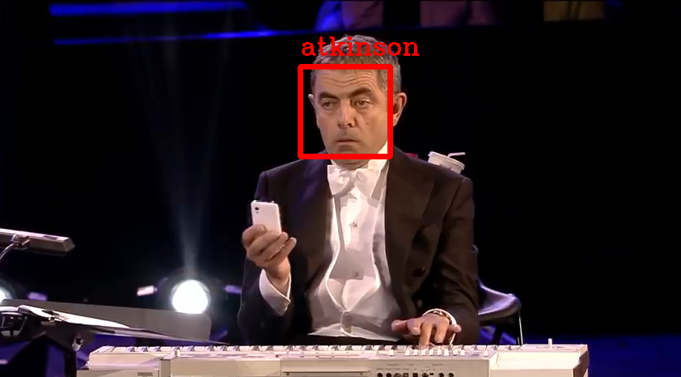
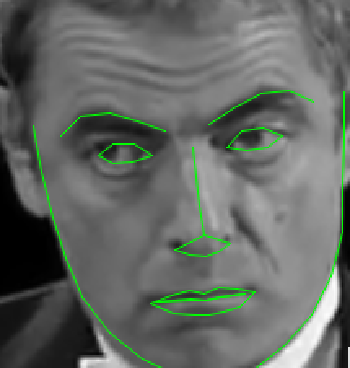
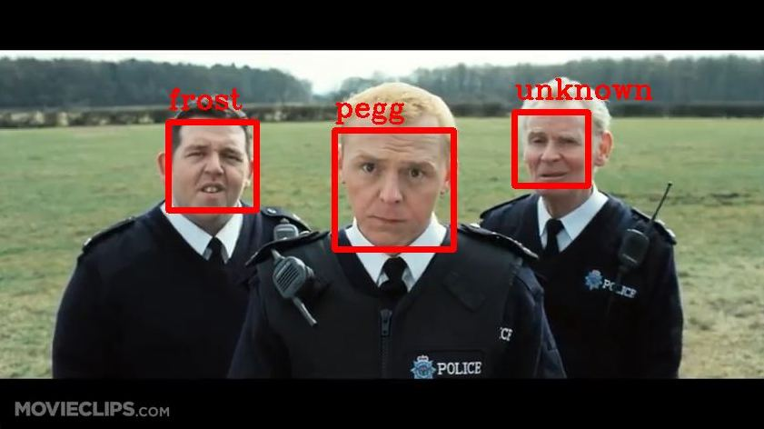
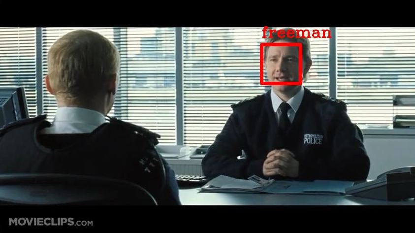
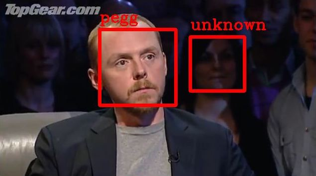
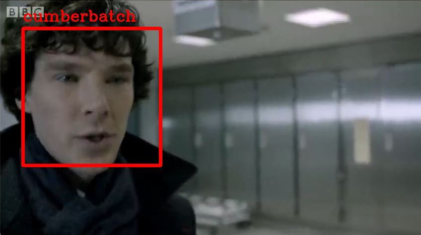
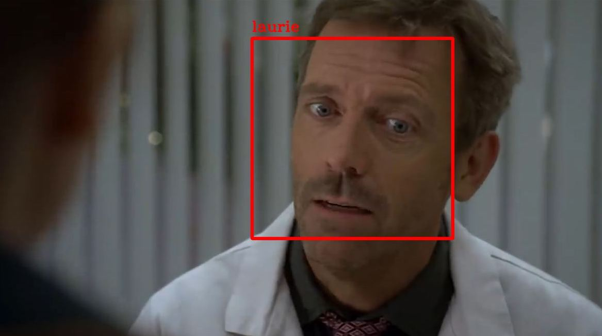

# Face Detector

Hello! This project is intended to be the final project for "2D Image Processing" course.

## Build

Let's start from the basics. You need to build the project in order to try it out yourself.

A few prerequisites should be met beforehand:
- C++ 17 compiler installed, check out [this guide](https://en.cppreference.com/w/cpp/compiler_support/17) to verify your compiler;
- OpenCV installed and configured to work with CMake: if not, please, [check out this guide](https://docs.opencv.org/4.x/d7/d9f/tutorial_linux_install.html);
- You have stable Internet connection as [CMake needs to download dlib library](./Project/CMakeLists.txt#L25)

If everything is ready to go I am happy to proceed to the building stage. You need to navigate to the [`Project`](./Project) folder and run the following chain of commands:

```bash
mkdir build
cd build

cmake ..
make -j7
```

Once is done, you should see `bin` directory inside your `build` folder. 
Please, do verify that the `bin` folder has an executable file and a few additional files: 
`dlib_face_recognition_resnet_model_v1.dat`, `haarcascade_frontalface_alt.xml`, 
`haarcascade_frontalface_alt2.xml`, `haarcascade_frontalface_default.xml`, 
`haarcascade_lefteye_2splits.xml`, `haarcascade_lefteye_2splits.xml`, and `shape_predictor_68_face_landmarks.dat`. 
If for some reason the files are not there you need to copy them into the `bin` directory from [`misc`](./Project/misc).

Hooray 🎉 You're ready to start using the app.

P.S.: to run the program you need to navigate to the `bin` folder.

```bash
cd bin
```

## Data

I will briefly introduce the data before showing how to work with the app through your CLI. 

I gathered photos of 10 actors for further classification:

- [Rowan Atkinson](https://en.wikipedia.org/wiki/Rowan_Atkinson)
- [Emilia Clarke](https://en.wikipedia.org/wiki/Emilia_Clarke)
- [Sacha Baron Cohen](https://en.wikipedia.org/wiki/Sacha_Baron_Cohen)
- [Benedict Cumberbatch](https://en.wikipedia.org/wiki/Benedict_Cumberbatch)
- [Martin Freeman](https://en.wikipedia.org/wiki/Martin_Freeman)
- [Nick Frost](https://en.wikipedia.org/wiki/Nick_Frost)
- [Keira Knightley](https://en.wikipedia.org/wiki/Keira_Knightley)
- [Hugh Laurie](https://en.wikipedia.org/wiki/Hugh_Laurie)
- [Andrew Lincoln](https://en.wikipedia.org/wiki/Andrew_Lincoln)
- [Simon Pegg](https://en.wikipedia.org/wiki/Simon_Pegg)

You can find data for training inside [`Samples/Training`](./Samples/Training).

To test the quality I am using annotated video samples. 
Videos capture the same actors as actors above and contain some other people. 
Moreover, a few videos under the `unknown` folder predominantly contain people from the outside of the training set. 
You can find data for testing under [`Samples/Test`](./Samples/Test).

Overall, the data follows principles from [Open Set Face Recognition](https://jwdai.github.io/Research/OSFR/OSFR.htm).

P.S.: All the data is used for research purposes only.
I believe that this case qualifies as [fair usage](https://www.bl.uk/business-and-ip-centre/articles/fair-dealing-copyright-explained) and obey the UK copyright law. 
If you have any concerns, please, contact me using my email or opening an issue in the repository.

## Preparing dataset

I made data pre-processing prior training the model.

Pre-processing can be represented in a few steps:

| Step | Image  | Description  |
| ------- | --- | --- |
| 0. Scan |  | Scan the image from the `Samples` folder. |
| 1. Greyscale |  | Convert the image to greyscale to reduce amount of information. |
| 2. Find faces |  | Extract faces from the image using any face detector. |
| 3. Detect eyes |  | If applicable, detect eyes on within found faces and rotate them using a sample idea: left and right eyes' centers should be approximately on the same line. |
| 4. Save |  | Save extracted faces to your disk. |
| 5. Validate |  | Discard invalid faces: bad image quality, extreme rotation angle, and so on. |


You can find pre-processed data under the [`TrainSet`](./TrainSet) folder.

This step can be performed automagically 🪄 by using the command below:

```bash
./FaceDetector ../../../Samples/Training/atkinson --dataset -o ./preprocessing_results [-d]
```

The command accepts a list of image files and/or folder containing image files as the first parameter immediately followed by `--dataset` flag that specifies the mode. Although this arguments are making a complete command you can also find useful a few extra flags:

| Argument | Optional | Desciption                                                                         |
|----------|---------|-----------------------------------------------------------------------------------|
| `-o`     | ✅       | *Output folder*: specifies the final directory for output images. All images will be named in the following order `\*original file name\*_face_\*id of a face\*. |
| `-d`     | ✅       | *Debug flag*: if specified then the app displays detected face on the image.                    |

**Note: I am using face detection at this step therefore I want to give you a 
heads-up about the face detection stage and face "normalisation" logic under the hood.**

### Face rotation explained


To rotate the image back to the "normal" position
we need to find an angle between the horizontal-axis and the line connecting two eyes' centers.

The angle can be calculated using school math ideas:

```math
angle=arctan(\frac{dx}{dy})
```

where

```math
dx = |left_eye.x - right_eye.x|
```

and

```math
dy = |left_eye.y - right_eye.y|
```

You can find the corresponding code in [OpenCVFaceDetectionModel](./Project/src/opencv_face_detection_model.cpp#L81).

### A brief implementation overview


The base class [FaceDetectionModel](./Project/include/face_detection_model.h#L76) abstracts different approaches to face detection:
- [OpenCVFaceDetectionModel](./Project/include/opencv_face_detection_model.h#L17) uses Haar-like features cascade classifier. 
Moreover, the class accepts face cascades files in a constructor to provide more flexibility in trying different classifiers; 
- [DLibFaceDetection](./Project/include/dlib_face_detection_model.h#L10) uses HOG-based classifier and allows to 
detect sides of the face in addition to frontal face detection. It seems like a more powerful technique but usually comes with
additional performance overhead.

### Different approaches comparison

#### Classifier: `OpenCVFaceDetectionModel` + `haarcascade_frontalface_default.xml`

Pros:
- Fast: definitely can work in runtime

Cons:
- Classifier has a lot of false-positive detections, therefore not accurate

| Not a face detected                                 | Not a face detected                                 |
|-----------------------------------------------------|-----------------------------------------------------|
|  |  |

| Metric | Score |
|--------|-------|
| Recall | 0.755 |

#### Classifier: `OpenCVFaceDetectionModel` + `haarcascade_frontalface_alt.xml`

Pros:
- Fast: can work in runtime
- Detects much less false-positive faces

Cons:
- Still has some false-positive detections
- Detects fewer faces: sometimes ignores the face that looks visible and just fine

| Face was not detected                           | Not a face detected                             |
|-------------------------------------------------|-------------------------------------------------|
|  |  |

| Metric   | Score |
|----------|-------|
| Recall   | 0.788 |

#### Classifier: `OpenCVFaceDetectionModel` + `haarcascade_frontalface_alt2.xml`

Pros:
- Fast: can work in runtime
- Detects more faces than `frontalface_alt`
- Detects more false-positive faces than `frontalface_alt` but fewer than `default` classifier

Cons:
- Has some false-positive detections
- Sometimes does not detect faces as the `frontalface_alt` but amount of undetected faces is a bit smaller

| Not a face detected                              | Face was not detected                            |
|--------------------------------------------------|--------------------------------------------------|
|  |  |

| Metric   | Score |
|----------|-------|
| Recall   | 0.830 |

#### Classifier: `DLibFaceDetection`

Pros:
- Still can work in runtime but works slower than the other classifiers, so its usage is a bit arguable and depends
on the task/project
- Can find faces even if they are partially outside of viewport bound

Cons:
- Has false-positive detections
- Finds fewer "small" faces: to solve this problem we can pyramid up the image more though it will affect performance

| Face from the side                        | Face detected however the lighting conditions are not perfect |
|-------------------------------------------|---------------------------------------------------------------|
|  |                      |

| Metric   | Score |
|----------|-------|
| Recall   | 0.854 |

#### Conclusion

Perhaps in this work I will use the `frontalface_alt2` cascade classifier from OpenCV even
if it works a bit worse than a dlib classifier as it feels a bit performance-wise better.

## Training

After we pre-processed our faces and saved them to the disk we can train our recognition model.
We can use the command below:

```bash
./FaceDetector ../../../TrainSet --train -om ./output_model.yml -ol ./output_labels.txt
```

As you can see this command accepts a folder with images followed by mode `--train` and **2 mandatory flags**: 
output model file `-om` and output labels file `-ol`.

Please, do keep in mind that **a label** for the face will be extracted from the name of folder where the image lays.

For example, if your image lays within `a/b/c/image.png` then the label for this image will be `c`.

After execution command creates 2 files: `model` and `labels`.

I am using preprocessed data from the previous step located in the [`TrainSet`](./TrainSet) folder.
The content of this folder looks like the images below:

| Face 1                                      | Face 2                                    | Face 3                                     | Face 4                                  | Face 5                                    |
|---------------------------------------------|-------------------------------------------|--------------------------------------------|-----------------------------------------|-------------------------------------------|
|  |  |  |  |  |

### Implementation considerations


Base class [FaceRecognitionModel](./Project/include/face_recognition_model.h)
represents an abstract recognition model. Every model supports 4 basic
operations:
- **write:** to serialise the internal representation of the model into some file
- **read:** to deserialise model's representation from file 
- **train:** teaches your model on some data; if your model has
been trained, serialised, and then deserialised from a file 
it should be fine to skip the `train` step and do some predictions
- **predict:** predicts the class label for the given face image

An algorithm for face recognition can be represented in 2 steps:
1. Extract features from the image as a vector or vectors;
2. Use any machine learning technique to spot relationship between the extracted vector/vectors and the given classes.

In there project were considered a few approaches with different scores.

#### BowRecognitionModel

Bag of visual words: pretty classic approach to analyse different classes of objects.

I was using SIFT to extract features from the face and then tried to apply
K Nearest Neighbours clustering algorithm to extract specific features from the
given vectors.

At the end SVM or KNN used to match feature vectors.


| Extracted features example, Atkinson        | Extracted features example, Cohen           |
|---------------------------------------------|---------------------------------------------|
|  |  |


Pros:
- Not observed

Cons:
- Prediction quality is quite low. My explanation for observed results:  
all faces have pretty close visual features and it is really
hard to spot any distinct qualities unless the face under observation
has some distinct features: scars, tattoo, hair patterns, and so on
- Bad performance: mapping extracted features to the specific visual words
is an expensive operation and can be hardly applied in runtime, moreover,
clustering during the training process on extracted features takes a significant amount 
of time (~10 mins).

For my case every object has been recognised as **Emilia Clarke**

| Atkinson                                               | Atkinson                                               | Cohen                                               |
|--------------------------------------------------------|--------------------------------------------------------|-----------------------------------------------------|
|  |  |  |

__I believe this is almost useless to calculate the metrics when you have the only
classification result.__

#### HogRecognitionModel

Instead of extracting features and combining them into visual words we can
try to consider extracted features as a face descriptor and then use KNN to match the vectors.

Frankly speaking, this approach works much better than Bag of Visual Words although
far away from ideal.

To normalise the HOG vector I am scaling all images to the same size [128x128]
without preserving aspect ratio. Such transformation should preserve possible image features while
aspect ratio preserving rescaling followed by center cropping will leave some features behind.

A few examples are given below:

| Correct: Atkinson                                      | Correct: Atkinson, however, has a few errors           |
|--------------------------------------------------------|--------------------------------------------------------|
|  |  |

| Correct: Knightley                                      | Incorrect: Knightley                                    |
|---------------------------------------------------------|---------------------------------------------------------|
|  |  |

| Incorrect. Was: Laurie, shoud be: Clarke                | Correct: Cohen                                          |
|---------------------------------------------------------|---------------------------------------------------------|
|  |  |

#### DnnRecognitionModel

This is a Deep Neural Network model from DLib library.
The recognition works in a few steps:

1. Using a random forest to find [68 facial landmarks](https://www.researchgate.net/figure/68-facial-landmarks_fig1_338048224)
2. Using a dnn model to convert these 68 points to 128D vector
3. Use KNN to find the class' label

| Extracted features example, Lincoln       | Extracted features example, Cohen         | Extracted features example, Atkinson       | Extracted features example, Pegg           |
|-------------------------------------------|-------------------------------------------|--------------------------------------------|--------------------------------------------|
|  |    |  |  |

This model works much better than the others.

| Correct: Forst, Pegg, Unknown                         | Correct: Freeman                                      |
|-------------------------------------------------------|-------------------------------------------------------|
|  |  |

| Correct: Pegg, Unknown                                | Correct: Cumberbatch                                     |
|-------------------------------------------------------|----------------------------------------------------------|
|  |  |

| Correct: Freeman                                        | Correct: Laurie                                       |
|---------------------------------------------------------|-------------------------------------------------------|
|    |  |

#### Conclusion

I will bear with the `DNN` approach as the most accurate one.

## Processing videos

It is time to see how the app works.
To start the app one may use the command below:

```bash
./FaceDetector ../../../Samples/Test --process -im ../../../Samples/model_dnn_knn.yml -il ../../../Samples/mapping_labels.dat [-t optional] [-d optional]
```

As you've seen earlier the command accepts a directory with images and/or images
list separated by space and followed by `--process` mode. The command has **2 mandatory
and 2 optional arguments**.

| Argument | Optional | Desciption                                                                         |
|----------|---------|-----------------------------------------------------------------------------------|
| `-im`      | ❌       | *Input model*:  your trained model from the previous step.                         |
| `-il`      | ❌       | *Input labels*: your labels from the previous step.                                |
| `-t`       | ✅       | *Test against annotations*: test your videos against annotations and see the score. |
| `-d`       | ✅       | *Debug*: slows down the video when matching against some frame.                    |

After running the command you will see the video output.


Below is a command example of running the app with a `debug` flag and testing against some config.

```bash
./FaceDetector ../../../Samples/Test/atkinson/2.mp4 --process -im ../../../Samples/model_dnn_knn.yml -il ../../../Samples/mapping_labels.dat -t -d
```

When debugging you will see app detections in **red** and annotations in **blue**. See the example below:

| Frame 50                                             | Frame 150                                            |
|------------------------------------------------------|------------------------------------------------------|
|  |  |

## Performance considerations

To save some computational resources and save some processing time the app performs face detection and
recognition every **10** frames, in between the app tries to keep track of already detected frames.

There are a few image trackers implemented in the project. See the comparison table below.
Please, do note, that to compute __detection + tracking score__ I was using previously selected models: 
`DNN` + `frontalface_alt2`.

### KCF

Pros:
- Fast: can work in runtime without any visible artifacts
- Mostly accurate: track faces in the wast majority of cases

Cons:
- Loose objects that have been previously detected
- Tracks objects that left the frame

| Scene 1                                         | Scene 2                                         |
|-------------------------------------------------|-------------------------------------------------|
|  |  |

| Metric   | Score  |
|----------|--------|
| Recall   | ~0.828 |

### MIL

Pros:
- Seems like detects faces more accurate than `KCF`

Cons:
- Slow: still may be tolerable for runtime but works slower than `KCF`
- Tracks an object even if the object is not in the frame
- Still not perfect: sometimes as `KCF` just loose previously detected faces

| Scene 1                                         | Scene 2                                         |
|-------------------------------------------------|-------------------------------------------------|
|  |  |

| Metric   | Score  |
|----------|--------|
| Recall   | ~0.830 |

### CSRT

Pros:
- Seems like detects faces more accurate than `KCF` and even `MIL`
- Keeps tracking longer even when face is turned almost sideways

Cons:
- Slow: still may be tolerable for runtime but works slower than `KCF` and `MIL`
- May track an object even if the object left the frame

| Scene 1                                         | Scene 2                                          |
|-------------------------------------------------|--------------------------------------------------|
|  |  |

| Metric   | Score  |
|----------|--------|
| Recall   | ~0.840 |

### GOTURN

__Please, note, you need to download from the Internet and 
put into the same folder where the executable file is located 
2 special files: `goturn.caffemodel` and `goturn.prototxt`.
The tracker won't work without these files.__

Pros:
- Looks like tracking is mostly accurate

Cons:
- Slow: a total disaster, not feasible to use in runtime
- Has major tracking issues when there are a few objects close to each other resulting
in visual artifacts or enormous detections bounds
- Sometimes the bounds are inaccurate

| Enormous bound                                     | Close objects collapse                             | Inacurate bounds                                   |
|----------------------------------------------------|----------------------------------------------------|----------------------------------------------------|
|  |  |  |

| Metric   | Score  |
|----------|--------|
| Recall   | ~0.434 |


### Conclusion

I will use `KCF` in my final work as it seems as a good tradeoff between quality and performance.

## Annotations

### Make your own annotations

To make your own annotations file your file you need to follow the annotations structure given below:

```bash
 frame_index_1
 label1 rect1.x,rect1.y,rect1.width,rect1.height
 label2 rect2.x,rect2.y,rect2.width,rect2.height
 
 ...
 
 frame_index_n
 labeln rectn.x,rectn.y,rectn.width,rectn.height
 ...
```

You can see an example under `Samples/Test`, like, [`atkinson/1.txt`](./Samples/Test/atkinson/1.txt).

Please, do keep in mind, to make the automagic 🪄 work you need to put your annotations file in the same folder where the
video sample is located **and** give it exactly the same name with a different extension - `.txt`.

For example, your video sample is `a/b/c/amazing_video.mp4` the annotations file should be `a/b/c/amazing_video.txt`.

### Verify your annotations

To verify your annotations you may run the command in a specific `--config` mode:

```bash
./FaceDetector ../../../Samples/Test/pegg/3.mp4 --config
```

You will see something similar to the image below. If you see similar result 
you created annotations config successfully. Congratulations!


## Metrics calculation

### Detection quality

To analyse quality I am relying mostly on recall (aka true positive rate).
True positive rate can be calculated using the following formulae:

```math
TPR=\frac{TP}{FN+TP}
```

However, the task requires to show additional metrics, like FNR (false negative rate) and FPR (false positive rate).
I have a few observations about these metrics that looks rather confusing.

#### FNR

```math
FNR=\frac{FN}{FN+TP}
```

If we add FNR to TPR we will get

```math
TPR+FNR=\frac{TP}{FN+TP}+\frac{FN}{FN+TP}=\frac{TP+FN}{FN+TP}=1
```

therefore

```math
FNR=1-TPR
```

However, I will calculate this metric using the original formulae.

#### FPR

We can get FPR using the formulae below:

```math
FPR=\frac{FP}{TN+FP}
```

Calculating true negative cases does make any sense.
True negative means that we do not detect the area as a face and this is a right call.
So, there are a lot of rects (in theory infinitely many) that have not been recognized. 
Adding this metric to the final report will create unnecessary noise, therefore I am considering `TN` score as `∞`.

Taking into considerations this logic we can modify `FPR` formulae

```math
TN \rightarrow \infty
```

```math
FPR = \frac{FP}{TN+FP} = lim_{x \rightarrow +\infty}\frac{FP}{x+FP} = 0
```

It does not seem reasonable to keep track of the metric. So, `FPR` will be always `0` in my report.

### Recognition quality

For recognition there are 2 sets:
- __People we know.__ I am using multiclass confusion matrix.
- __Unknown people.__ I am using a confusion matrix for binary classification.

## Quality

### Detection

| Metric | Score   |
|--------|---------|
| TPR    | ~0.828  |
| FNR    | ~0.172  |
| FPR    | 0       |

### Recognition

#### Closed set of people (people we know)

| Metric   | Score  |
|----------|--------|
| Accuracy | ~0.987 |

#### Unknown people

| Metric   | Score  |
|----------|--------|
| TPR    | ~0.996 |
| FNR    | ~0.004 |
| FPR    | 0.021  |

Full report can be found in [the report file](./REPORT)

Wow! You've really made this through the document. Thank you for reading!

